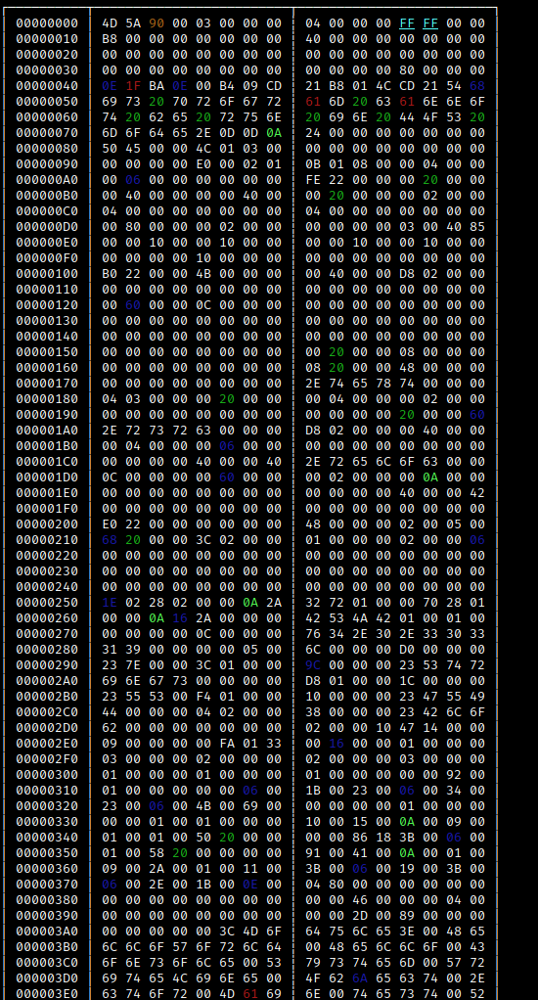
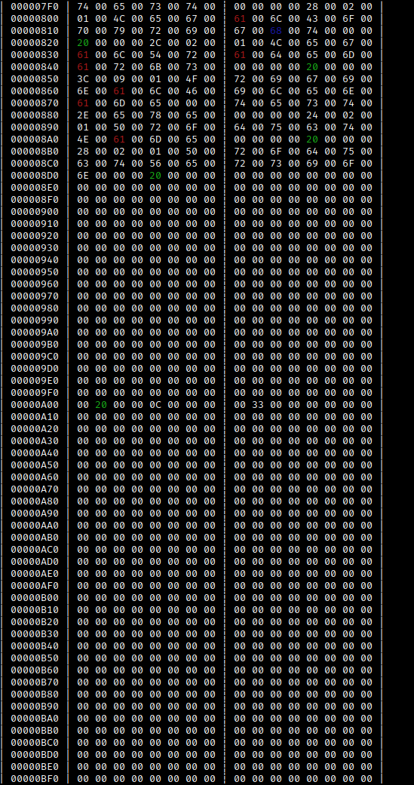

# HEXer

HEXer is a small hex viewer written in lua.

## Installation

You need Lua to run HEXer.
You can install Lua using this command:
~~~
sudo apt install lua5.3
~~~

## Usage

You can simply execute the script:

~~~
./HEXer.lua filename
~~~

Or explicitly:

~~~
lua ./HEXer.lua filename
~~~

## License

HEXer is licensed under the MIT license.